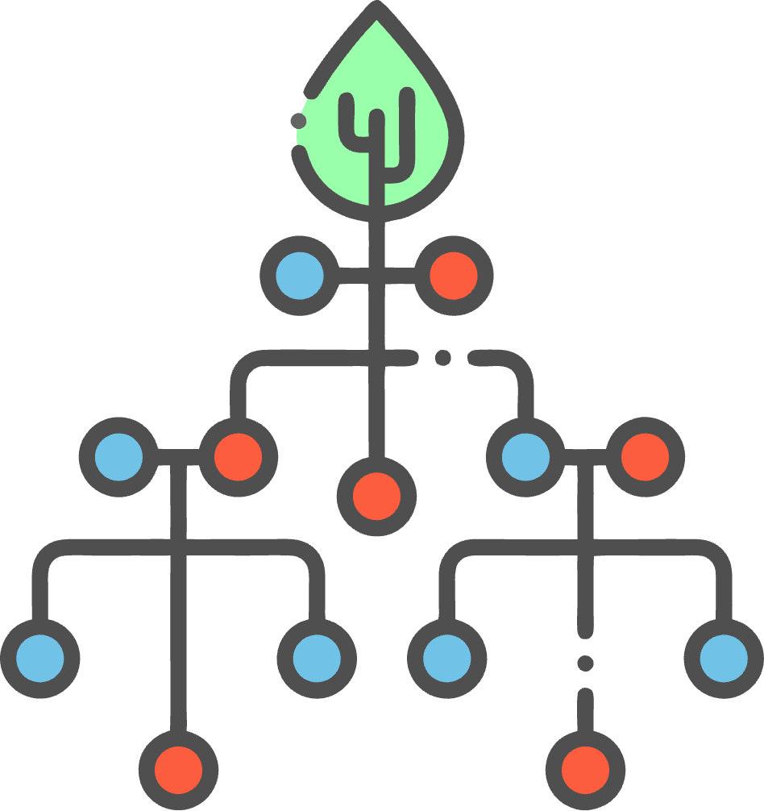

<div align="center">
  <a href="https://github.com/kairos-xx/tree-interval">
    
  </a>
  <h1>Tree Interval</h1>
  <p><em>A powerful Python package for managing, analyzing, and visualizing tree structures with rich interval-based node positioning</em></p>
  
  <a href="https://replit.com/@kairos/treeinterval">
    
  </a>
  
</div>

## ✨ Features

- 🔮 **Future Class**: Powerful dynamic attribute handling with context-aware error reporting and smart chain creation
- 📍 **Position-Aware Nodes**: Track code positions with line numbers, column offsets and intervals
- 🌲 **AST Analysis**: Built-in support for Python AST traversal and node location
- 🔍 **Frame Analysis**: Runtime code inspection with frame position tracking
- 🎨 **Rich Visualization**: Multiple visualization options including ASCII trees and Rich-based pretty printing
- 💾 **JSON Serialization**: Full support for saving and loading tree structures
- 🔎 **Flexible Node Search**: Parent, child and sibling search with custom predicates

## 🚀 Quick Start

### Dynamic Attribute Handling with Future

```python
from tree_interval import Future

class Nested:
    def __init__(self):
        self.__dict__ = {}
        
    def __getattr__(self, name):
        return Future(name, frame=1, instance=self)

# Dynamic attribute chain creation
obj = Nested()
obj.a.b.c = 42  # Creates nested structure automatically
print(obj.a.b.c)  # 42

# Smart error reporting
print(obj.x.y.z)  # Raises detailed error with context
```

### Tree Operations

```python
from tree_interval import Tree, Leaf, Position

# Create a basic tree
tree = Tree("Example")
root = Leaf(Position(0, 100), "Root")
child = Leaf(Position(10, 50), "Child")

tree.root = root
tree.add_leaf(child)

# Visualize the tree
tree.visualize()
```

## 📦 Installation

```bash
pip install tree-interval
```

## 🎯 Core Components

### Position Types
```python
# Basic Position
pos = Position(0, 100)

# Line-Aware Position
pos = Position(0, 100)
pos.lineno = 1
pos.end_lineno = 5

# Column-Aware Position
pos = Position(0, 100)
pos.col_offset = 4
pos.end_col_offset = 8
```

### Tree Visualization
```python
# Basic ASCII Tree
tree.visualize()

# Rich Pretty Printing
from tree_interval.rich_printer import RichTreePrinter
printer = RichTreePrinter()
printer.print_tree(tree)
```

## 📚 Documentation

- [Core Components](docs/wiki/Core-Components.md)
- [Installation Guide](docs/wiki/Installation.md)
- [Visualization Guide](docs/wiki/Visualization.md)
- [API Reference](docs/API_REFERENCE.md)

## 💡 Use Cases

1. **Code Analysis**
   - Track source positions in AST nodes
   - Locate runtime code execution points
   - Analyze code structure and relationships

2. **Tree Visualization** 
   - Debug tree structures
   - Generate documentation
   - Analyze hierarchical data

3. **Position Tracking**
   - Map source locations
   - Track text positions
   - Handle nested intervals

## 📝 License

This project is licensed under the MIT License - see the [LICENSE](LICENSE) file for details.

---

<div align="center">
  <sub>Built with ❤️ by Kairos</sub>
</div>
